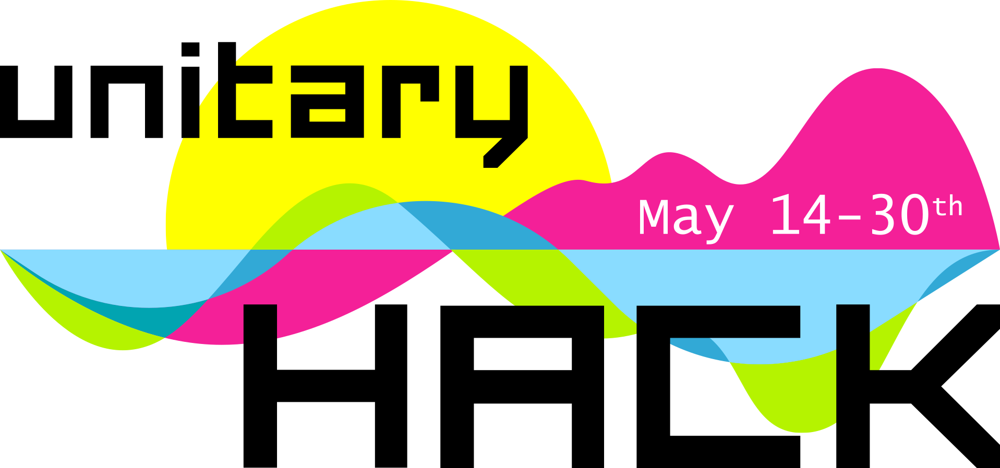

## Check out unitaryHACK 2022 at https://unitaryhack.dev/ and its Github Repo [here](https://github.com/unitaryfund/unitaryhackdev). 

<figure>

<figcaption style="max-width: 60%;
        height: auto; margin: auto;
  display: block;font-size:.8em">
 Quantum computing isn’t just unitary, it’s open source!
</figcaption>
</figure>

### The Unitary Fund was proud to host our first quantum open source hackathon with SWAG and BOUNTIES on **May 14-30th**!

- 💰 Over $K in bounties for tagged issues in quantum open source projects

- 💿 Digital swag for all participants that make approved Pull Requests (PR)s

- 🎁 Random participants that make 1 **quality** Pull Request (PR)s to a participating open source project got a [swag pack in the mail!*](./rules.md)

[RESULTS HERE!](https://2021.unitaryhack.dev/results.html)

### Thanks to our supporters

- [Unitary Fund](https://unitary.fund/)
- [Xanadu](https://xanadu.ai/)
- [PASQAL](https://pasqal.io/)

### Support future unitaryHACKs 🙏
Would you like to help us support more contributors and projects? [Get in touch](mailto:info@unitary.fund?subject=[UnitaryHack]%20Supporting%20You) with us!

### Want your project to participate in the next hack?

We would love to support your quantum open source project by connecting eager hackers to issues you need help with!
Check out our [maintainer guide](./maintainer-guide.md)
## Stay tuned for details on the next unitaryHACK!

You can find some tips on how to prepare for the hackathon the next event in our [hacker guide](./hacker-guide.md) as well as the [hackathon rules](./rules.md). You can always ask questions of the Unitary Fund team on our [Discord](http://discord.unitary.fund), and make sure to check out [our code of conduct](CODE_OF_CONDUCT.md).
