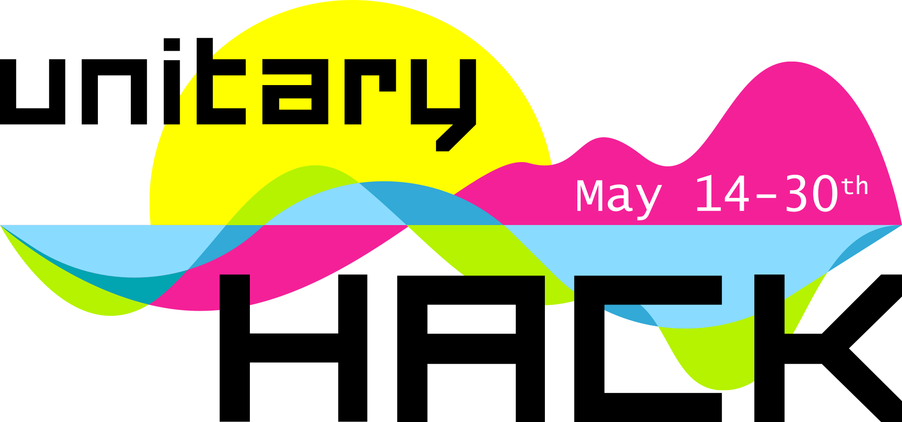

<table class="tg">
<tbody>
  <tr>
    <th colspan="2">Check out unitaryHACK 2022 at <a href="https://unitaryhack.dev">https://unitaryhack.dev</a> and its Github Repo <a href="https://github.com/unitaryfund/unitaryhackdev">here</a>.</th>
  </tr>
</tbody>
</table>

 

<table class="tg">
<tbody>
  <tr>
    <th colspan="2">🏆 <a href="./results.html">Full results</a> 🏆</th>
  </tr>
  <tr>
    <td>🎉 Hacks completed: 64 </td>
    <td>💰 Bounties awarded: 26 </td>
  </tr>
</tbody>
</table>

<!-- <progress id="prs" max="50" value="60" style="width:100%;height:40px;"> 60/50 </progress> -->

 

<!-- 

  <h4 id="headline">The hacking starts in:</h4>
  

  <table>
    <tr>
        <td style="font-size:3em"></td>
        <td style="font-size:3em"></td>
        <td style="font-size:3em"></td>
        <td style="font-size:3em"></td>
    </tr>
    <tr>
      <td>Days</td>
      <td>Hours</td>
      <td>Minutes</td>
      <td>Seconds</td>
    </tr>
    </table>
  

 -->

<figure>

<figcaption style="max-width: 60%;
        height: auto; margin: auto;
  display: block;font-size:.8em">
 Quantum computing isn’t just unitary, it’s open source!
</figcaption>
</figure>

### The Unitary Fund is proud to host our first quantum open source hackathon with SWAG and BOUNTIES on **May 14-30th**!

- 💰 Over $2K in bounties for tagged issues in quantum open source projects

- 💿 Digital swag for all participants that make approved Pull Requests (PR)s

- 🎁 Random participants that make 1 **quality** Pull Request (PR)s to a participating open source project will receive a [swag pack in the mail!*](./rules.md)

<!-- <button style="max-width: 60%;height: auto; margin: auto;display: block;background-color:#ffff00;border-width:0em;font:'Lucida Console', monospace, !default;font-size:2em;" type="button" onclick="location='https://airtable.com/embed/shrTG20PLC5cjVIPr'"><b>SIGN UP HERE!</b></button> -->

### Need help getting started or unstuck?

Come join our friendly team on [Discord](http://discord.unitary.fund) and ask folks LIVE your git, open source, or quantum questions! 

<iframe class="airtable-embed" src="https://airtable.com/embed/shrY0gGMjY2aK3yT1?backgroundColor=pink" frameborder="0" onmousewheel="" width="100%" height="300" style="background: transparent; border: 1px solid #ccc;"></iframe>

You can find some tips on how to participate in our [hacker guide](./hacker-guide.md) as well as the [hackathon rules](./rules.md), and you can always ask questions of the Unitary Fund team on our [Discord](http://discord.unitary.fund). Make sure to check out [our code of conduct](CODE_OF_CONDUCT.md) as well.

### Thanks to our supporters!

<table class="tg">
<tbody>
  <tr>
    <td class="tg-sj11"><a href="https://unitary.fund/"><strong>Unitary Fund</strong></a></td>
    <td class="tg-sj11"><a href="https://xanadu.ai/"><strong>Xanadu</strong></a></td>
    <td class="tg-sj11"><a href="https://pasqal.io/"><strong>PASQAL</strong></a></td>
    <td class="tg-sj11"><a href="https://dorahacks.com/"><strong>DoraHacks</strong></a></td>
  </tr>
</tbody>
</table>

#### Support this project🙏

Would you like to help us support more contributors and projects? [Get in touch](mailto:info@unitary.fund?subject=[UnitaryHack]%20Supporting%20You) with us!
